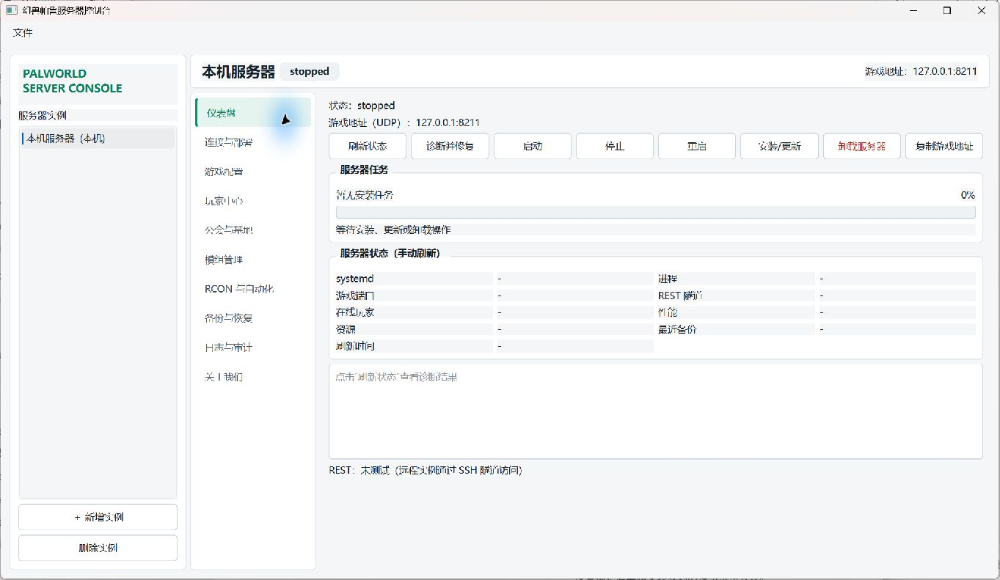
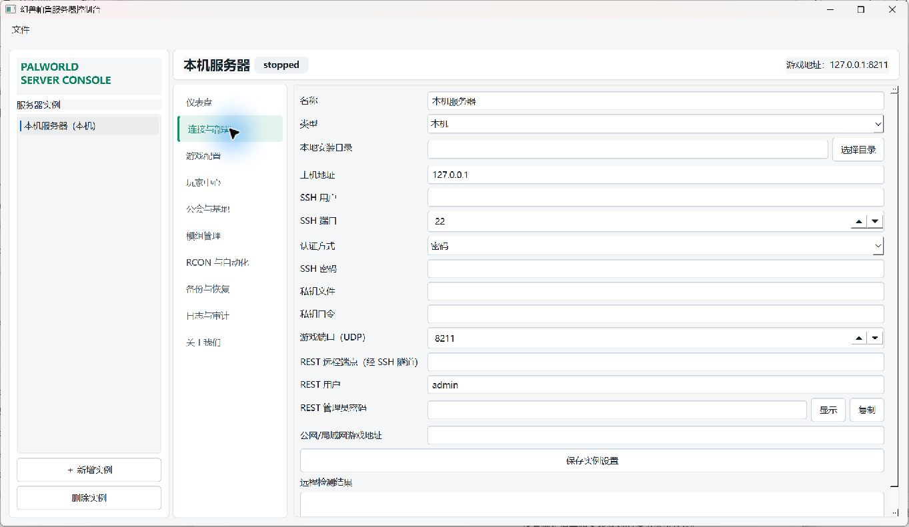
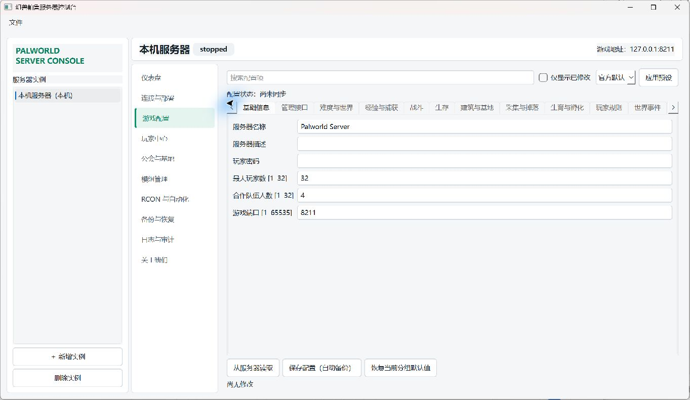

# Palworld One-Click Server Tool

> 幻兽帕鲁一键开服工具：用一个 Windows 桌面控制台完成本机开服、远程 Linux/Windows Server 部署、配置、玩家管理、模组、备份与日常运维。

作者：江小白 Cresent

基于 Python 与 PySide6，支持管理本机 Windows Dedicated Server，也支持通过 SSH 自动识别和管理远程 Linux `systemd` 或 Windows Server `WinSW` 实例。远程 REST 与 RCON 默认通过 SSH 隧道访问，管理端口无需直接暴露到公网。

## 界面预览

### 服务器仪表盘

集中查看服务状态、游戏地址、任务进度、端口、玩家、性能和最近备份，并直接执行安装、更新、启动、停止、重启和诊断。



### 连接与部署

同一个实例表单同时覆盖本机与远程服务器。本机只需指定安装目录；远程实例填写 SSH 信息后，工具会自动识别操作系统，并探测磁盘、权限、SteamCMD、PalServer、服务、配置、存档和日志路径。



### 游戏配置

将 `PalWorldSettings.ini` 拆分为中文分类表单，支持搜索、预设、范围校验、仅查看改动、离线草稿、配置缓存、外部修改冲突检查、自动备份和重启提示。



## 开服流程


1. **创建实例**：在左侧新增服务器，选择“本机”或“远程 SSH”。
2. **保存连接信息**：本机选择一个普通可写目录；远程填写主机、用户和认证方式，然后执行自动检测。
3. **安装或接管服务端**：点击“安装/更新”。工具会维护 SteamCMD、安装 AppID `2394010`，并生成所需配置。
4. **调整游戏规则**：在“游戏配置”中读取服务器配置，应用预设或逐项修改，保存时自动创建备份。
5. **启动并检查**：回到仪表盘启动服务，刷新状态并确认 UDP 游戏端口、REST、性能和日志没有异常。
6. **分享连接地址**：复制 `服务器公网地址:8211` 给玩家。`8212/TCP` 是 REST 管理端口，不是游戏连接端口。
7. **持续运维**：使用玩家中心、模组管理、RCON、计划任务、备份恢复和日志审计完成日常管理。

## 功能设计

| 工作区 | 主要能力 | 设计重点 |
| --- | --- | --- |
| 仪表盘 | 安装、更新、启停、重启、卸载、健康检查、端口诊断 | 高频操作集中展示，长任务提供阶段与进度反馈 |
| 连接与部署 | 本机目录、SSH、SteamCMD、systemd/WinSW、路径自动探测 | 同一套实例模型管理本机与远程环境 |
| 游戏配置 | 60 余项中文配置、搜索、预设、离线草稿、持久缓存 | 密码不写 JSON，推送前检测服务器外部修改 |
| 玩家中心 | 同步、玩家选择、中文帕鲁/物品名、属性、背包、公会 | 四步主流程，统一草稿、预览、保存和失败重试 |
| 公会与基地 | 在线快照、成员关系、基地与帕鲁统计 | 高风险关系修改必须停服并经过完整校验 |
| 模组管理 | Workshop/ZIP/URL 来源、UE4SS Mods、NativeMods、迁移包 | 统一部署到 UE4SS；不写入 PalModSettings.ini，原生 Linux 只读 |
| RCON 与自动化 | 命令控制台、白名单、主机级计划任务 | 高风险命令确认，远程连接默认走 SSH 隧道 |
| 备份与恢复 | `.pwcbackup`、导入导出、组件恢复、跨实例迁服、保留策略 | CRC/SHA-256 校验、配置脱敏、恢复点与失败回滚 |
| 日志与审计 | 运行日志、筛选、导出、管理操作记录 | 关键操作可追溯，不在日志中保存凭据明文 |

## 核心能力

- 自动下载、校验和初始化 SteamCMD，并安装或更新 Palworld Dedicated Server。
- 远程 SSH 自动识别 Linux、Windows Server 或未知系统；Windows 命令统一使用编码 PowerShell，Linux 使用 Bash。
- Windows Server 自动维护实例目录内的 SteamCMD 与校验后的 WinSW 2.12.0，并使用低权限服务账户运行 PalServer。
- SQLite 永久玩家档案通过 UID 与平台账号安全聚合，REST 与存档重复记录只显示一次。
- 中文存档字段注册表展示字段含义、来源、有效范围、可写状态、只读原因和风险等级。
- 中文资源采用用户覆盖、游戏/导入资源、内置词典和内部 ID 回退四级解析，可导入 `pal.json`、`items.json` 等版本化目录。
- 配置快照和离线草稿按实例保存在本机；管理员密码与玩家密码继续存入系统凭据管理器。
- 原生 Linux 保持官方模组禁用，但可浏览和下载 Workshop 包，并通过隔离 Wine 迁移向导安全切换或恢复原生服务。
- Source RCON 控制台、白名单策略、高风险命令确认与操作审计。
- 远程使用 `systemd timer`，本机使用 Windows 任务计划执行备份、重启等任务。
- 服务器侧计划备份保存在安装目录外层的 `_backups/palworld-console`，下次 SSH 检测时自动下载、转换、校验并加入当前实例的本地备份库。
- 统一 `.pwcbackup` ZIP 容器支持仅含 `SaveGames` 的世界导出包，以及包含脱敏配置的完整灾备包；可导入旧 ZIP/TAR、目录和 `Level.sav`。
- 恢复向导按世界、配置或经 PlM 验证的单玩家角色生成差异计划；跨实例恢复保留目标端口、路径、服务、SSH 与凭据，失败自动回滚。
- 旧格式存档使用 `palworld-save-tools==0.24.0`；`PlM1` 存档使用隔离的固定提交插件进行结构化修改、二次解析、原子替换和失败回滚。

## 安装运行

要求：Windows 10/11、Python 3.10 或更高版本。

```powershell
git clone https://github.com/yibeixiaobai/palworld-one-click-server-tool.git
cd palworld-one-click-server-tool
py -m venv .venv
.\.venv\Scripts\Activate.ps1
pip install -e .
python run.py
```

也可以运行：

```powershell
.\create_desktop_shortcut.ps1
```

脚本会在桌面创建启动快捷方式。

## Windows 安装版与自动更新

项目的 GitHub Releases 提供当前用户级 Windows 安装包 `PalworldConsole-Setup-vX.Y.Z.exe`。安装目录位于 `%LOCALAPPDATA%\Programs\PalworldConsole`，安装和升级通常不需要管理员权限。

- 正式安装版启动后会后台检查最新稳定 Release；也可以在“关于我们”页面手动检查。
- 下载完成后程序会验证 Release 中 `SHA256SUMS.txt` 提供的 SHA-256，再询问是否退出并启动安装器。
- 用户数据、服务器实例配置和备份位于 `~/.palworld-console`，覆盖安装和卸载程序不会主动删除这些数据。
- 当前安装包尚未使用 Authenticode 代码签名，Windows SmartScreen 可能显示来源警告；SHA-256 仅用于校验下载完整性，不能替代代码签名。

## 发布 Windows 版本

仓库的 `Release Windows` GitHub Actions 工作流只能从 `main` 分支手动运行。运行时选择 `patch`、`minor` 或 `major`，工作流会更新 `palworld_console/VERSION`，完成测试、PyInstaller 打包和 Inno Setup 编译，然后提交版本、创建 `vX.Y.Z` tag 和正式 Release。

`palworld_console/VERSION` 是项目唯一版本源。运行时版本、Python 包版本、Windows 文件版本、安装器版本、Release tag 和资产文件名均从该文件派生。仓库分支保护需要允许 `GITHUB_TOKEN` 向 `main` 推送版本提交和 tag。

## 本机部署说明

选择一个用于 Palworld Dedicated Server 的普通可写目录，例如 `D:\PalworldServer` 或 `E:\Games\PalworldServer`。工具会在该目录创建 `_tools\steamcmd`，维护 `steamcmd.exe`，并使用 AppID `2394010` 安装服务端。完整卸载会同时移除当前实例目录内的 SteamCMD 工具目录。

## 远程部署说明

- 支持密码或私钥 SSH 认证，凭据保存到 Windows Credential Manager。
- 自动检测现有服务端；Linux 由 `systemd` 托管，Windows Server 由固定版本 WinSW 托管。
- Windows Server 需要预先启用 OpenSSH Server 和 PowerShell 5.1+；SSH 无法连接时，需要先通过 RDP 或云厂商控制台执行一次性 OpenSSH 初始化。
- Windows 自动选择空间最大的可写固定磁盘，并拒绝磁盘根目录、系统目录、UNC 路径和重解析点逃逸。
- REST 与 RCON 默认绑定到 SSH 隧道，不要求开放公网管理端口。
- 游戏 UDP 端口仍需在云安全组、主机防火墙和必要的路由器端口映射中放行。

## 模组兼容性

| 服务端环境 | 支持状态 |
| --- | --- |
| Windows Dedicated Server | 支持官方 `Mods/Workshop`、`Mods/ManagedMods` 与 `PalModSettings.ini` |
| Linux Wine | 实验性支持，部署后必须执行健康检查 |
| 原生 Linux Dedicated Server | 官方服务端模组不可用，界面会禁用安装操作 |

Workshop、ZIP 和 PAK 包会校验 `Info.json`、安装规则、依赖、冲突与 SHA-256。模组只修改当前服务器文件，不会替玩家安装客户端模组。

## 安全边界

- SSH 密码、私钥口令和管理密码保存在 Windows Credential Manager，实例 JSON 仅保存引用。
- 高级存档编辑禁止修改正在运行的世界；写回前必须停服并完成本地与服务器侧备份。
- 公会、基地、玩家或帕鲁的删除、迁移属于高风险操作，应先在备份副本中验证。
- 模组部署统一使用 UE4SS/Mods 与 UE4SS/NativeMods；Workshop、ZIP、URL 仅作为下载来源，不写入官方 PalModSettings.ini 或 ManagedMods。
- 模组部署需要停服、完整备份、重启和健康检查；旧官方模组只保留并标记为待迁移。
- 玩家中心按“同步玩家数据 → 选择角色 → 编辑 → 预览并保存”工作；保存失败自动回滚但保留草稿，可直接重试。
- PlM 插件不可用、构建失败或格式校验不通过时，存档功能保持只读，不猜测未知字段。
- 程序不会自动操作云厂商控制台，也不会主动将 REST 或 RCON 端口暴露到公网。
- 备份包不会保存管理员密码、玩家密码、SSH 凭据、私钥路径或完整玩家 IP；恢复配置时从目标实例的系统凭据管理器重新注入密码。
- 单玩家恢复不直接复制 `Players/<UID>.sav`，仅在 UID、公会、帕鲁 GUID、容器和槽位关系完整时执行结构化合并。

## 开源致谢

- PySide6
- Paramiko
- keyring
- requests
- palworld-save-tools（MIT，旧格式适配）
- PalworldSaveTools 固定提交插件中的 `palsav-flex` / `palooz`（GPL-3.0-or-later；按需本机构建，不随主程序分发）

部分存档结构化流程参考 `palworld-server-tool` 的固定提交（Apache-2.0）。上游 `palooz` 所含部分 Oodle 压缩源码存在额外授权警告，因此插件与主程序隔离且不随安装包再分发。本项目不包含地图功能，也不复制参考项目界面或素材。
